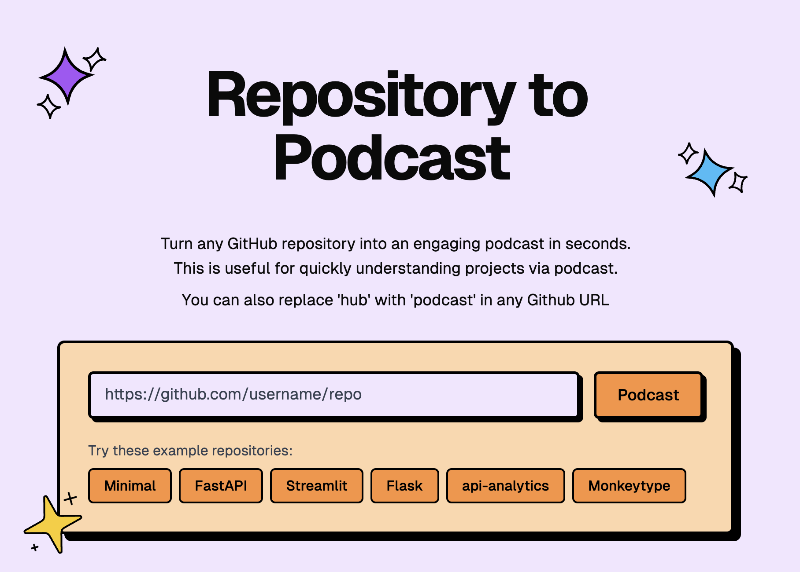

HEAD
# GitToPod
For study use

<div align="center">

[](https://github.com/BandarLabs/gitpodcast/stargazers)
[](https://github.com/BandarLabs/gitpodcast/blob/master/LICENSE)
</div>

<div align="center">
<a href="https://www.producthunt.com/posts/gitpodcast?embed=true&utm_source=badge-featured&utm_medium=badge&utm_souce=badge-gitpodcast" target="_blank"></a>
</div>

[](https://gitpodcast.com/)


# GitPodcast

Turn any GitHub repository into an engaging podcast in seconds.

You can also replace `hub` with `podcast` in any Github URL to access its podcast.

## 🚀 Features

- 👀 **Instant Podcast**: Convert any GitHub repository structure into a podcast
- 🎨 **Customization**: Choose Voices (WIP)
- ⚡ **Fast Generation**: Powered by OpenAI and Azure Speech SDK
- 🌐 **API Access**: Public API available for integration (WIP)
- 💰**Cost Effective**: Free (via Gemini Flash + Azure Speech SDK)

## ⚙️ Tech Stack

- **Frontend**: Next.js, TypeScript, Tailwind CSS, ShadCN
- **Backend**: FastAPI, Python, Server Actions
- **Database**: PostgreSQL (with Drizzle ORM)
- **AI**: OpenAI 4o / Azure Speech
- **Deployment**: Vercel (Frontend), EC2 (Backend)
- **CI/CD**: GitHub Actions
- **Analytics**: PostHog, Api-Analytics

## 🛠️ Self-hosting / Local Development

1. Clone the repository

```bash
git clone https://github.com/BandarLabs/gitpodcast.git
cd gitpodcast
```

2. Install dependencies

```bash
pnpm i
```

3. Set up environment variables (create .env)

```bash
cp .env.example .env
```

Then edit the `.env` file with your OpenAI API key for SSML and Azure AI Speech Key for TTS (https://azure.microsoft.com/en-us/pricing/details/cognitive-services/speech-services/).

You can also use `Gemini Flash` for the SSML. You will need to change the code from `OpenAIService` to `GeminiService`.

4. Run backend

```bash
docker-compose up --build -d
```

Logs available at `docker-compose logs -f`
The FastAPI server will be available at `localhost:8000`

5. Start local database

```bash
chmod +x start-database.sh
./start-database.sh
```

When prompted to generate a random password, input yes.
The Postgres database will start in a container at `localhost:5432`

6. Initialize the database schema

```bash
pnpm db:push
```

You can view and interact with the database using `pnpm db:studio`

7. Run Frontend

```bash
pnpm dev
```

You can now access the website at `localhost:3000` and edit the rate limits defined in `backend/app/routers/generate.py` in the generate function decorator.

## Contributing

Contributions are welcome! Please feel free to submit a Pull Request.

## Acknowledgements

Shoutout to [Romain Courtois/Ahmed Khalil]'s [Gitingest](https://gitingest.com/) and [Gitdiagram](https://gitdiagram.com/) for inspiration and styling

## 📈 Rate Limits

I am currently hosting it for free with the following rate limits. If you would like to bypass these, self-hosting instructions are provided. I also plan on adding an input for your own OpenAI API key.

Podcast generation:

- 15 API calls/minute via Gemini Flash Exp. 2.0 for Github -> SSML
- 0.5 million characters for SSML -> Speech (via Azure Speech Service)


## 🤔 Future Steps

- Allow user to choose Voices
- Remove dependence on Anthopic of token count
- Allow user prompts
7d4a61c (Initial commit)
